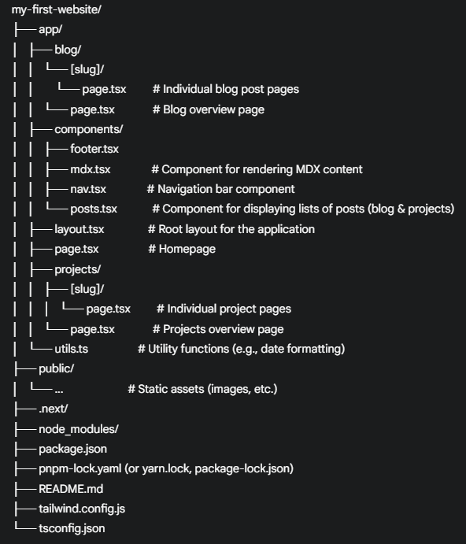

# gurnoor.net - My Personal Portfolio & Blog

[](https://nextjs.org/)
[](https://www.typescriptlang.org/)
[](https://vercel.com/)

Welcome to gurnoor.net! This is my personal website and online space where I share my journey as an aspiring Software Developing Engineer. Here, you'll find my weekly blog posts, showcasing my learnings and progress in the world of computer science, as well as information about the projects I'm working on.

**[Visit gurnoor.net](https://gurnoor.net/)** to see the website live.

## About

This website serves as:

* **My Portfolio:** A place to exhibit the projects I've developed and am currently exploring.
* **My Blog:** A platform to share my weekly insights, learnings, and experiences in software development. My goal is to inspire other women coders and document my progress in the field.
* **A Learning Tracker:** A personal tool to keep track of my advancements and milestones in computer science.

**Reference:** The structure and design of this website are inspired by the [Vercel Portfolio Starter Kit](https://vercel.com/templates/next.js/portfolio-starter-kit).

## Technologies Used

This website is built using the following key technologies:

* **[Next.js](https://nextjs.org/):** A powerful React framework for building server-rendered and statically generated web applications.
* **[React](https://react.dev/):** A JavaScript library for building user interfaces.
* **[TypeScript](https://www.typescriptlang.org/):** A statically typed superset of JavaScript that enhances code maintainability and reduces errors.
* **[MDX](https://mdxjs.com/):** An extension of Markdown that allows you to seamlessly write JSX within your Markdown content, ideal for blog posts and project descriptions.
* **[Tailwind CSS](https://tailwindcss.com/):** A utility-first CSS framework for rapid UI development (based on your `global.css` import).
* **[Geist Fonts](https://vercel.com/font/geist):** A set of modern and readable fonts (based on your `layout.tsx`).
* **[sugar-high](https://github.com/rauchg/sugar-high):** A syntax highlighting library (based on your `components/mdx.tsx`).
* **[Vercel Analytics](https://vercel.com/analytics):** For website analytics (based on your `layout.tsx`).
* **[Vercel Speed Insights](https://vercel.com/speed-insights):** For performance monitoring (based on your `layout.tsx`).

## Features

* **Blog Section:** Read my latest thoughts, learnings, and updates on various computer science topics.
* **Projects Showcase:** Discover the projects I'm working on, with detailed descriptions and links to live demos and GitHub repositories where applicable.
* **Responsive Design:** The website is designed to look and function well on various screen sizes.
* **Clean and Minimalist UI:** Focused on readability and ease of navigation.
* **Syntax Highlighting:** Code snippets in blog posts and project descriptions are beautifully formatted for better understanding.

## Getting Started

To run this project locally on your machine:

1.  **Clone the repository:**
    ```bash
    git clone [https://github.com/kgurnoor/my-first-website.git](https://github.com/kgurnoor/my-first-website.git)
    cd my-first-website
    ```

2.  **Install dependencies:**
    ```bash
    npm install
    # or
    yarn install
    # or
    pnpm install
    ```

3.  **Start the development server:**
    ```bash
    npm run dev
    # or
    yarn dev
    # or
    pnpm dev
    ```

4.  **Open your browser** and navigate to `http://localhost:3000` to view the website.

## Project Structure

The main directories and files in this project include:


## Contributing

While this is my personal portfolio and blog, I appreciate feedback and suggestions. If you notice any issues or have ideas for improvements, feel free to open an issue on this repository.

## Connect with Me

You can find me on:

* **[LinkedIn](https://www.linkedin.com/public-profile/settings?lipi=urn%3Ali%3Apage%3Ad_flagship3_profile_self_edit_contact-info%3BnkIb603nTI%2BgggCvr55bog%3D%3D)**
* **[GitHub](https://github.com/kgurnoor)**